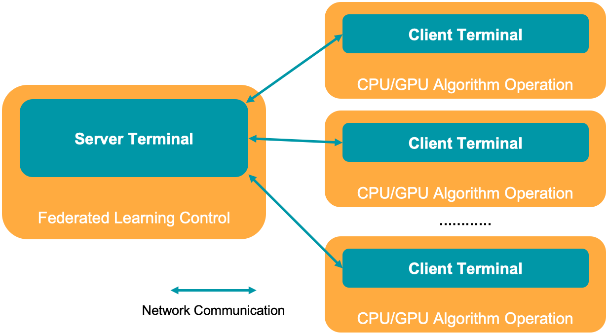
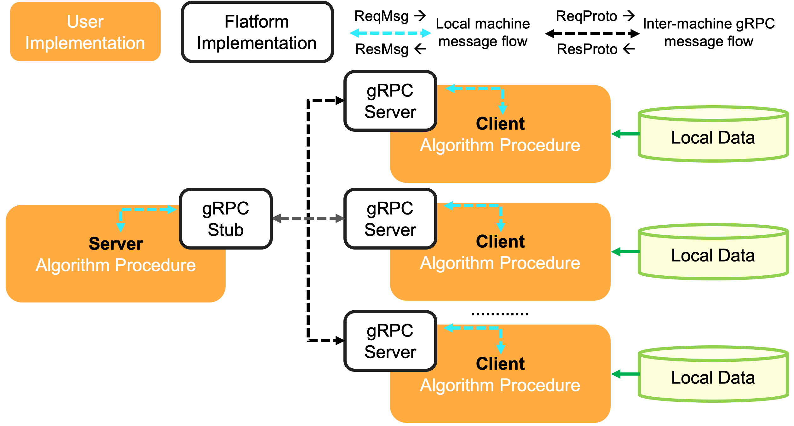

# FedLearn-algo

## Installation
### Development Environment Checklist
python3 (3.6 or 3.7) is required. To configure and check the development environment is correct, a checklist file is provided: [environment_checklist.sh](environment_checklist.sh). Under the path of FedLearn-algo, please run:
```
sh environment_checklist.sh
```

### Recommended Python Package
| *Package* | *License* | *Version* | *Github* | 
|-------------------------|-------------------------|-------------------------|-------------------------|
| datasets | MIT | 1.8.0 | https://github.com/huggingface/datasets |
| gmpy2 | LGPL 3.0 | 2.0.8 | https://github.com/BrianGladman/gmpy2 |
| grpc | Apache 2.0 | 1.38.0 | https://github.com/grpc/grpc |
| numpy | BSD 3 | 1.19.2 | https://github.com/numpy/numpy |
| omegaconf | BSD 3 | 2.1.0 | https://github.com/omry/omegaconf |
| oneflow | Apache 2.0 | 0.4.0 | https://github.com/Oneflow-Inc/oneflow |
| orjson | Apache 2.0 | 3.5.2 | https://github.com/ijl/orjson |
| pandas | BSD 3 | 1.2.4 | https://github.com/pandas-dev/pandas |
| phe | LGPL 3.0 | 1.4.0 | https://github.com/data61/python-paillier |
| sklearn | BSD 3 | 0.24.2 | https://github.com/scikit-learn/scikit-learn |
| tensorflow | Apache 2.0 | 2.4.1 | https://github.com/tensorflow/tensorflow |
| torch | BSD | 1.9 | https://github.com/pytorch/pytorch |
| tornado | Apache 2.0 | 6.1 | https://github.com/tornadoweb/tornado |
| transformers | Apache 2.0 | 4.7.0 | https://github.com/huggingface/transformers |
| protobuf | 3-Clause BSD | 3.12.2 | https://github.com/protocolbuffers/protobuf |

### Device Deployment
The device deployment is a centralized distributed topology, as shown in the above figure. The server terminal controls the training loop, and the N client terminals operate independent algorithm computation, respectively. For non-deep learning algorithms, each client terminal depends on CPU-based computation, otherwise GPU (e.g., NVIDIA series) should be configured to guarantee training speed.



## Run an Example
An [**algorithm flow**](demos/custom_alg_demo/readme.md) example is provided to demonstrate a **customized algorithm development** (one server terminal with three client terminals). Server should communicate with each client. The server and three clients could be sited on different machines or started by command line terminal in one machine.

First, users should set the IP, port, and token. In client terminals, run the following commands, respectively.
```
python demos/custom_alg_demo/custom_client.py -I 127.0.0.1 -P 8891 -T client_1
python demos/custom_alg_demo/custom_client.py -I 127.0.0.1 -P 8892 -T client_2
python demos/custom_alg_demo/custom_client.py -I 127.0.0.1 -P 8893 -T client_3
```

Second, in the server terminal, run the following to start the server and complete a simulated training pipeline.
```
python demos/custom_alg_demo/custom_server.py
```

## Architecture Design
FedLearn-algo is an open source framework in the research environment to promote the study of novel federated learning algorithms. FedLearn-algo proposes a distributed machine learning architecture enabling both vertical and horizontal federated learning (FL) development. This architecture supports flexible module configurations for each particular algorithm design, and can be extended to build state-of-the-art algorithms and systems. FedLearn-algo also provides comprehensive examples, including FL-based kernel methods, random forest, and neural networks. At last, the horizontal FL extension in FedLearn-algo is compatible with popular deep learning frameworks, e.g., PyTorch, OneFlow.



The above figure shows the proposed FL framework. It has one server and multiple clients to complete the multi-party joint modeling in the federated learning procedure. The server is located at the centre of architecture topology, and it coordinates the training pipeline. Clients operate modeling computation independently in local terminals without sharing data, and thus could protect data privacy and data security.

## Demonstration Algorithms
According to the data partition differences, existing FL algorithms can be mainly categorized into horizontal FL algorithms and vertical FL algorithms. Horizontal FL refers to the setting that samples on the involved machines share the same feature space while the machines have different sample ID space. Vertical FL means all machines share the same sample ID space while each machine has a unique feature space.

### Vertical Federated Learning
* [**Federated Kernel Learning**](demos/kernelmethod/readme.md). Kernel method is a nonlinear machine learning algorithm to handle linearly non-separable data.

* [**Federated Random Forest**](demos/random_forest/README.md). Random forest is an ensemble machine learning method for classification and regression by building a multitude of decision trees in model training. 

### Horizontal Federated Learning
* [**Federated HFL**](demos/HFL/README.md). An extension framework in FedLearn-algo designed to provide flexible and easy-to-use algorithms in Horizontal Federated scenarios.

## Documentation
* [**Technical Report**](docs/reports/2107.04129.pdf)

* [**API Documentation**](docs/api/build/html/index.html)

## License
The distribution of FedLearn-algo in this repository is under [**Apache 2.0 license**](LICENSE). 

## Citation
Please cite [**FedLearn-algo**](https://arxiv.org/abs/2107.04129) in your publications if it makes some contributions to your research/development:
```
@article{liu2021fedlearn,
  title={Fedlearn-Algo: A flexible open-source privacy-preserving machine learning platform},
  author={Liu, Bo and Tan, Chaowei and Wang, Jiazhou and Zeng, Tao and Shan, Huasong and Yao, Houpu and Heng, Huang and Dai, Peng and Bo, Liefeng and Chen, Yanqing},
  journal={arXiv preprint arXiv:2107.04129},
  url={https://arxiv.org/abs/2107.04129},
  year={2021}
}
```

## Contact us
Please contact us at <fedlearn-support@jd.com> if you have any questions.

