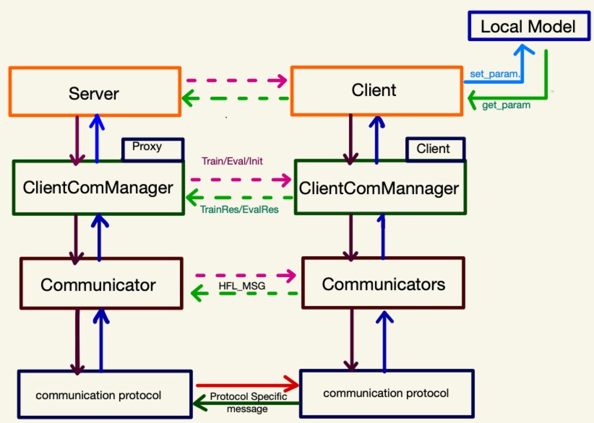

## FedLearn-algo HFL: Horizontal Federated Learning Framework (FA-HFL)

Horizontal Federated Learning Framework is an extension framework to FedLearn-algo aimed to provide flexible and easy-to-use algorithms in Horizontal Federated 
scenarios. FA-HFL is able to support any model, any ML/DL library, plugin any communication protocols and HFL aggregating algorithms.

### HFL Design </br>


FA-HFL is build on several layers of control/data flow logics from low-level communication protocol to med-level client-model training/evaluation  management 
and high-level server-client  aggregation. It decouples control flow, training aggregation algorithm, communication protocol, different models share the same 
control flow and data flow.  FA-HFL provides means to reduce the effort and complexity to quickly build HFL pipeline, while still retaining flexibility to add/
adapt new algorithms at any control/data flow level. </br>


### **Features**
#### ***- Library and model antagonistic***

FA-HFL supports most of major libraries such as Pytorch, Tensorflow, Oneflow with large NLP models such as Bert and it variants.
It can support any library of any model as long as users implement ```set_param``` and ```get_param``` that allows updating and acquiring model's parameters.
Examples of training large model (Bert pre-training and finetuning) in FA-HFL are provided in using both Pytorch ```(demos/HFL/example/pytorch)``` and Oneflow ```(demos/HFL/example/Oneflow)```.


#### ***- Communication protocol plugin***
 FA-HFL provides means to easily replace default communication protocol with any user desired communication protocol by implementing
 a few functions in ```Message_Sender```, ```Message_Receiver``` and ```HFLMsg_Converter```, See ```(demos/HFL/example/communicator)``` for details.

#### ***- Other in development features***
Asynchronous training,  model compression and parameter reduction.

### Examples:
#### ***Start  Server***
*Start a Server that requires minimum of 2 clients and using GRPC communication protocol .*
```bash
python demos/HFL/app/run_server.py --num_client=2 --comm_type=grpc
```
#### ***Start a Client***
*Start a client of Pytorch  Bert using GRPC  communication protocol with designated server's ip address, client's ip port. *
*** 
```bash
python demos/HFL/app/run_client.py --client_port=8922 --model_name=pytorch_bert --server_ip=127.0.0.1 --server_port 8890 --comm_type=grpc
```