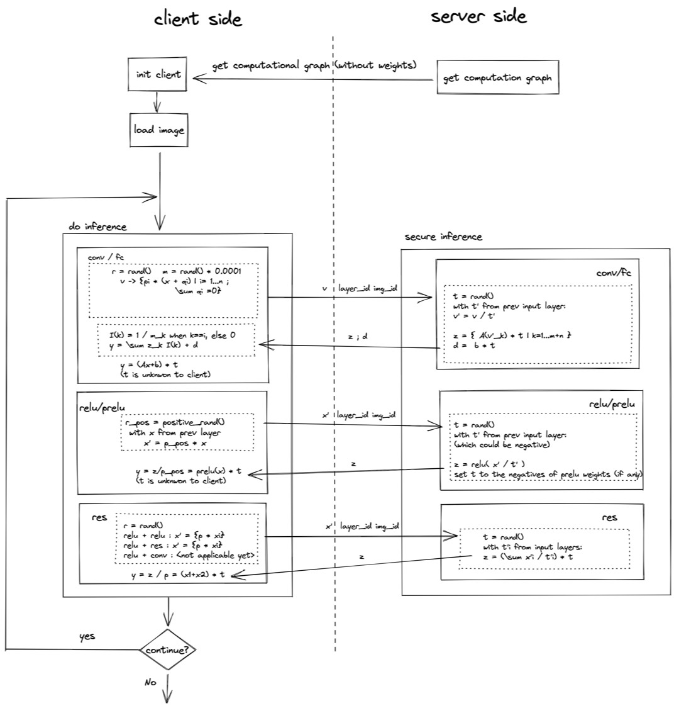

# Secure inference use fedlearn-algo framework, with SphereFace as an example

## 1. performance overview

Table below is a comparison of the performance with different implementations. Numbers are tested on MacBook Pro.

| *Version* | *TPS* | *Latency* |
|-------------------------|-------------------------|-------------------------|
| Insecure | 9.09 |  0.11 |
| Secure_Sync | 0.87 | 2.31  |
| Secure_Async | 0.96 | 2.07 | 

## 2. How to run the code
We will be using the current directory as the working directory for all experiments. Before run any code, we will need to unzip the LFW dataset from `./data/LFW`

### 2.1 Insecure inference

The model is adopted from [sphereface](https://github.com/clcarwin/sphereface_pytorch). A visualization of its architecture can be seen from [here](http://ethereon.github.io/netscope/#/gist/20f6ddf70a35dec5019a539a502bccc5).

```
python insecure/run.py
```

### 2.2 Secure inference, sync version

First, at the server side, run the following commands to initialize the service.
```
python secure_sync/server_side/server_SecInf.py -I 127.0.0.1 -P 8890 -T server
```

Second, at the client terminal, run the following commands to start the secure inference pipeline with LFW images.
```
ython secure_sync/client_side/SecInf_client.py 
```


### 2.3 Secure inference, async version (Final version)

Firstly, to start the server, run:
```
python secure_async/server_side/run_server_async.py
```

Second, start a new terminal for client and run the following commands to start the secure inference pipeline with LFW images:
```
python secure_async/client_side/run_client_async.py
```


## 3. Workflow of our secure inference

### 3.1 async version


### 3.2 sync version
Note that priority queue fits the best in building the message queue, due to the fact that there are ~100 interactions between client and server for each inference. A classical queue will results in similar TPS but much higher latency.

## 4. Experimental
Transferring float16 instead of float32 will increase the error rate from a magnitude of 10^-6 to around 5%, with a benefit of cutting the data transfer time to half.
This functionality can be achieved by modifying the `DTYPE` variable in `./utils/data_transfer.py`.